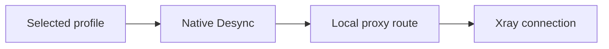

<div align="center">

# 🚀 PingNG

### A v2rayNG fork with Desync Engine

Control connection behavior per profile, customize TLS, and troubleshoot from one clean Android client.


**English** · [فارسی](README_FA.md)

</div>

---

## 🌟 Why PingNG?

PingNG keeps the familiar v2rayNG experience and adds a native, profile-aware Desync layer for Android. Each configuration can have its own Desync mode and parameters, and those settings are applied automatically when that configuration starts.

### At a glance

| Feature | v2rayNG | PingNG |
|---|:---:|:---:|
| Native Android Desync engine | — | ✅ |
| Per-configuration Desync settings | — | ✅ |
| Ready-to-use Desync profiles | — | ✅ |
| Smart custom parameter editor | — | ✅ |
| Random multi-domain Fake SNI | — | ✅ |
| Strict fail-closed Desync startup | — | ✅ |
| `unsafe` TLS fingerprint (PattNG) | — | ✅ |
| Editable Cipher Suites (PattNG) | — | ✅ |


## 🛡️ Desync Engine

The Desync engine runs natively on Android and does not require root access. Tap a configuration to select and edit the Desync profile that belongs to it.

### Built-in profiles

| Profile | Intended use |
|---|---|
| **Off** | Start the configuration without Desync |
| **Light** | Minimal processing and broad compatibility |
| **Balanced** | A practical balance for everyday use |
| **Severe** | Stronger processing for more restricted networks |
| **Adaptive** | Behavior adjusted to the connection |
| **Custom** | Full control over the available parameters |

### Custom methods

- `Split`
- `Disorder`
- `Fake SNI`
- `Out of Band`
- `Disorder + Out of Band`

Only the options relevant to the selected method are shown. Depending on the method, you can adjust values such as **Position**, **Fake TTL**, **Fake SNI**, **TLS Record Position**, and **Timeout**.

### Connection flow



If Desync is enabled, the engine must start and attach to the connection successfully. Otherwise, the VPN does not start. This prevents the connection from silently continuing without the selected Desync behavior.

## 🎲 Random multi-domain Fake SNI(SNI Spoofing)

Add multiple domains to **Fake SNI**, separated by commas:

```text
hcaptcha.com, speedtest.net, example.com
```

PingNG automatically:

- Converts spaces, new lines, semicolons, and `|` characters to comma separators.
- Removes duplicate entries.
- Selects one SNI randomly for every new connection.
- Keeps the selected SNI unchanged for the lifetime of that connection.

## 🔐 Extended TLS controls

- Adds `unsafe` to the available TLS fingerprint options.
- Provides an editable **Cipher Suites** field.
- Stores Cipher Suites with the selected profile.
- Applies the value to the generated Xray configuration.
- Preserves the value during supported import, export, and sharing flows.

## 🧩 Supported configuration types

Per-profile Desync is available for:

`VMess` · `VLESS` · `Shadowsocks` · `SOCKS` · `HTTP` · `Trojan`

## ✅ Verification notes

- Desync settings are stored per configuration and injected into the selected connection path.
- Display names map to the existing native methods without changing their runtime flags.
- Random Fake SNI selection has been confirmed through runtime logs.
- Native sources and Android resource files have been checked for syntax and structural errors.

Testing the APK on multiple Android versions, device vendors, and network conditions is still recommended before release.

## 🙏 Credits

- Based on [2dust/v2rayNG](https://github.com/2dust/v2rayNG) & PattNG
- PingNG development and interface: **ReZa Kh**
- TLS improvements were inspired by contributions from the v2rayNG community.

## ⚠️ Disclaimer

Use this project only in accordance with the laws of your country and the terms of the services you connect to. You are responsible for your configuration and usage.

---

<div align="center">

Made with ❤️ for Iranian people

</div>
