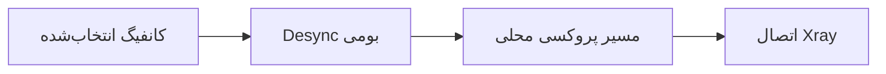

<div align="center" dir="rtl">

# 🚀 PingNG

### فورکی از v2rayNG با موتور Desync

کنترل رفتار اتصال برای هر کانفیگ، تنظیمات تکمیلی TLS و ابزار عیب‌یابی در یک کلاینت تمیز اندرویدی.


[English](README.md) · **فارسی**

</div>

---

## 🌟 چرا PingNG؟

PingNG تجربه‌ی آشنای v2rayNG را حفظ می‌کند و یک لایه‌ی Desync بومی و وابسته به پروفایل به اندروید اضافه می‌کند. هر کانفیگ می‌تواند حالت و پارامترهای Desync مخصوص خودش را داشته باشد و این تنظیمات هنگام اجرای همان کانفیگ به‌صورت خودکار اعمال می‌شوند.

### امکانات در یک نگاه

| قابلیت | v2rayNG | PingNG |
|---|:---:|:---:|
| موتور Native Android Desync | — | ✅ |
| تنظیم مستقل Desync برای هر کانفیگ | — | ✅ |
| پروفایل‌های آماده‌ی Desync | — | ✅ |
| ویرایشگر هوشمند پارامترهای Custom | — | ✅ |
| چند Fake SNI با انتخاب تصادفی | — | ✅ |
| اجرای سخت‌گیرانه و توقف هنگام خطای Desync | — | ✅ |
| Fingerprint از نوع `unsafe` | — | ✅ |
| تنظیم Cipher Suites | — | ✅ |

## 🛡️ Native Android Desync

موتور Desync به‌صورت بومی روی اندروید اجرا می‌شود و به دسترسی Root نیاز ندارد. با لمس هر کانفیگ می‌توانید پروفایل Desync مربوط به همان اتصال را انتخاب و ویرایش کنید.

### پروفایل‌های آماده

| پروفایل | کاربرد |
|---|---|
| **Off** | اجرای کانفیگ بدون Desync |
| **Light** | پردازش سبک با سازگاری گسترده |
| **Balanced** | تعادل مناسب برای استفاده‌ی روزمره |
| **Severe** | پردازش قوی‌تر برای شبکه‌های محدودتر |
| **Adaptive** | رفتار تطبیقی متناسب با اتصال |
| **Custom** | کنترل کامل پارامترهای موجود |

### روش‌های Custom

- `Split`
- `Disorder`
- `Fake SNI(SNI Spoofing)`
- `Out of Band`
- `Disorder + Out of Band`

فقط گزینه‌های مرتبط با روش انتخاب‌شده نمایش داده می‌شوند. بسته به روش، مقادیری مانند **Position**، **Fake TTL**، **Fake SNI**، **TLS Record Position** و **Timeout** قابل تغییر هستند.

### مسیر اتصال



اگر Desync فعال باشد، موتور باید با موفقیت اجرا و به مسیر اتصال متصل شود؛ در غیر این صورت VPN شروع نمی‌شود. به این ترتیب اتصال بدون اعمال تنظیمات انتخاب‌شده به‌صورت ناخواسته ادامه پیدا نمی‌کند.

## 🎲 چند Fake SNI با انتخاب تصادفی

چند دامنه را با کاما در فیلد **Fake SNI** وارد کنید:

```text
hcaptcha.com, speedtest.net, example.com
```

PingNG به‌صورت خودکار:

- فاصله، خط جدید، نقطه‌ویرگول و `|` را به جداکننده‌ی استاندارد کاما تبدیل می‌کند.
- ورودی‌های تکراری را حذف می‌کند.
- برای هر اتصال جدید یکی از SNIها را تصادفی انتخاب می‌کند.
- SNI انتخاب‌شده را تا پایان همان اتصال ثابت نگه می‌دارد.

## 🔐 کنترل‌های تکمیلی TLS

- گزینه‌ی `unsafe` به Fingerprintهای TLS اضافه شده است.
- فیلد **Cipher Suites** قابل ویرایش است.
- Cipher Suites همراه پروفایل انتخاب‌شده ذخیره می‌شود.
- مقدار آن به کانفیگ تولیدشده‌ی Xray اعمال می‌شود.
- در مسیرهای پشتیبانی‌شده‌ی Import، Export و Share حفظ می‌شود.

## 🧩 کانفیگ‌های پشتیبانی‌شده

تنظیم مستقل Desync برای این کانفیگ‌ها در دسترس است:

`VMess` · `VLESS` · `Shadowsocks` · `SOCKS` · `HTTP` · `Trojan`
## ✅ وضعیت بررسی

- تنظیمات Desync برای هر کانفیگ جداگانه ذخیره و به مسیر همان اتصال تزریق می‌شوند.
- نام‌های نمایشی جدید بدون تغییر فلگ‌های اجرایی به روش‌های Native موجود نگاشت شده‌اند.
- انتخاب تصادفی Fake SNI از طریق لاگ زمان اجرا تأیید شده است.
- سورس Native و منابع اندروید از نظر ساختار و خطاهای نحوی بررسی شده‌اند.

پیش از انتشار، آزمایش APK روی نسخه‌های مختلف اندروید، دستگاه‌های چند سازنده و شرایط شبکه‌ی متفاوت توصیه می‌شود.

## 🙏 قدردانی

- بر پایه‌ی پروژه‌ی [2dust/v2rayNG](https://github.com/2dust/v2rayNG)
- توسعه‌ی PingNG و رابط اختصاصی: **ReZa Kh**
- توسعه‌های TLS با الهام از مشارکت‌های جامعه‌ی v2rayNG انجام شده‌اند.

## ⚠️ مسئولیت استفاده

این پروژه را فقط مطابق قوانین کشور محل زندگی و شرایط سرویس‌های مورد استفاده به کار ببرید. مسئولیت پیکربندی و نحوه‌ی استفاده بر عهده‌ی کاربر است.

---

<div align="center" dir="rtl">

ساخته‌شده با ❤️ برای مردم ایران

</div>
