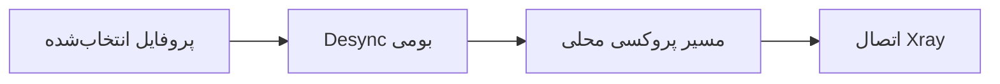

<div align="center">

# 🚀 PingNG

### نسخه‌ای از v2rayNG با موتور بومی Desync، ابزارهای WARP، MasterDNS و Psiphon CDN Fronting

رفتار اتصال را برای هر پروفایل تنظیم کنید، تونل‌های WARP را مدیریت کنید، تنظیمات TLS را تغییر دهید و مشکلات اتصال را در یک برنامهٔ اندرویدی بررسی کنید.


[English](README.md) · **فارسی**

</div>

---

## 🌟 چرا PingNG؟

PingNG تجربهٔ آشنای v2rayNG را حفظ می‌کند و Desync مخصوص هر پروفایل، گزینه‌های تونل WARP، MasterDNS و Psiphon CDN Fronting را به آن اضافه می‌کند. تنظیمات هر قابلیت همراه پروفایل مربوط به آن ذخیره می‌شود و هنگام اتصال اعمال می‌گردد.

### امکانات در یک نگاه

| قابلیت | v2rayNG | PingNG |
|---|:---:|:---:|
| Desync | — | ✅ |
| تنظیمات Desync برای هر پروفایل | — | ✅ |
| WARP Plus (Outer + Inner) | — | ✅ |
| WARP WireGuard | — | ✅ |
| WARP MASQUE/H2 | — | ✅ |
| MasterDNS | ✅ |
| Psiphon روی MasterDNS | — | ✅ |
| تنظیم و جست‌وجوی FinalMask برای پروفایل‌های WARP | — | ✅ |
| Psiphon CDN Fronting | — | ✅ |
| Psiphon روی WARP و WARP Plus | — | ✅ |
| ثبت کلید WARP از طریق پروکسی | — | ✅ |
| ویرایشگر هوشمند پارامترهای Desync سفارشی | — | ✅ |
| Fake SNI تصادفی با چند دامنه | — | ✅ |
| اثرانگشت TLS با مقدار `unsafe` (PattNG) | — | ✅ |
| Cipher Suites قابل ویرایش (PattNG) | — | ✅ |
| نمودار مصرف ترافیک | — | ✅ |
| اتصال از طریق پروکسی HTTP | — | ✅ |

## 🛡️ موتور Desync

موتور Desync به‌صورت بومی روی اندروید اجرا می‌شود و به دسترسی روت نیاز ندارد. برای یک اتصال پشتیبانی‌شده، پروفایل Desync را تنظیم کنید تا PingNG هنگام شروع همان اتصال آن را اعمال کند. WARP MASQUE/H2 می‌تواند Desync را از مسیر اتصال TLS بیرونی خود عبور دهد.

### پروفایل‌های آماده

| پروفایل | کاربرد |
|---|---|
| **Off** | اجرای کانفیگ بدون Desync |
| **Light** | پردازش کم و سازگاری گسترده |
| **Balanced** | تعادل مناسب برای استفادهٔ روزمره |
| **Severe** | پردازش بیشتر برای شبکه‌های محدودتر |
| **Adaptive** | تنظیم رفتار بر اساس اتصال |
| **Custom** | کنترل دستی پارامترهای موجود |

### روش‌های سفارشی

- `Split`
- `Disorder`
- `Fake SNI`
- `Out of Band`
- `Disorder + Out of Band`

فقط گزینه‌های مرتبط با روش انتخاب‌شده نمایش داده می‌شوند. بسته به روش، می‌توانید مقدارهایی مانند **Position**، **Fake TTL**، **Fake SNI**، **TLS Record Position** و **Timeout** را تغییر دهید.

### مسیر اتصال



اگر Desync فعال باشد، موتور آن باید با موفقیت اجرا و به مسیر اتصال متصل شود. در غیر این صورت VPN شروع نمی‌شود تا اتصال بدون رفتار Desync انتخاب‌شده برقرار نشود.

## 🌐 WARP

PingNG سه گزینهٔ WARP دارد:

- **WARP Plus** — پروفایل‌های WARP بیرونی و درونی با حالت‌های جست‌وجوی اندپوینت، تأیید و تنظیمات FinalMask.
- **WARP WireGuard** — پروفایل WARP تک‌مرحله‌ای مبتنی بر WireGuard با ساخت خودکار حساب و کلید و اسکن اندپوینت.
- **WARP MASQUE/H2** — تونل مستقل MASQUE روی HTTP/2 با اسکن اندپوینت و SNI قابل تنظیم.

### اسکن اندپوینت و FinalMask

اسکن WARP از حالت‌های انتخابی و اندپوینت‌های Custom پشتیبانی می‌کند. مرحلهٔ تأیید از اندپوینت‌های پیداشده در اسکن استفاده می‌کند و پیشرفت بررسی نامزدها را نمایش می‌دهد. فیلدهای FinalMask و **Find FinalMask Setting** برای پروفایل‌های WARP Plus و WARP WireGuard در دسترس‌اند.

### پروکسی ثبت کلید WARP

پروفایل‌های WARP گزینهٔ **Proxy** را برای ثبت حساب و کلید دارند. حالت **Auto** ابتدا ثبت مستقیم را امتحان می‌کند و در صورت نیاز به پروفایل VLESS داخلی **Proxy-1** برمی‌گردد. می‌توانید پروفایل‌های دیگر PingNG را هم انتخاب کنید. پروکسی داخلی ثبت‌نام به فهرست اصلی کانفیگ‌ها اضافه نمی‌شود.

## 🛡️ Psiphon و CDN Fronting

Psiphon را می‌توان برای هر کانفیگ، از جمله پروفایل‌های WARP و WARP Plus، فعال کرد. یکی از حالت‌های **Auto**، **Direct** یا **CDN Fronting** را انتخاب کنید:

- آدرس IP و نام سرور (SNI) دلخواه برای CDN وارد کنید.
- فهرست‌های داخلی لبه‌های CDN را انتخاب کنید یا از فهرست‌های پیش‌فرض استفاده کنید.
- در صورت نیاز، اتصال Psiphon را از پروکسی HTTP CONNECT تنظیم‌شده عبور دهید.

## 🌐 MasterDNS

گزینهٔ **Add [MasterDNS]** در انتهای منوی افزودن پروفایل قرار دارد. کلاینت شامل فایل‌های اجرایی برای معماری‌های رایج اندروید است. هنگام بررسی DNS resolverها، PingNG پیشرفت را به‌صورت زنده با قالب **بررسی‌شده/کل**، مثلاً `230/450`، نشان می‌دهد.

ویرایشگر MasterDNS گزینهٔ **Psiphon Over MasterDNS** را نیز با عنوان و توضیح مخصوص همین اتصال دارد.

## 🎲 Fake SNI تصادفی با چند دامنه

چند دامنه را با ویرگول در فیلد **Fake SNI** وارد کنید:

```text
hcaptcha.com, speedtest.net, example.com
```

PingNG به‌صورت خودکار:

- فاصله، خط جدید، نقطه‌ویرگول و نویسهٔ `|` را به جداکنندهٔ ویرگول تبدیل می‌کند.
- ورودی‌های تکراری را حذف می‌کند.
- برای هر اتصال جدید یک SNI را تصادفی انتخاب می‌کند.
- SNI انتخاب‌شده را تا پایان همان اتصال ثابت نگه می‌دارد.

## 🔐 تنظیمات گستردهٔ TLS

- مقدار `unsafe` را به گزینه‌های اثرانگشت TLS اضافه می‌کند (PattNG).
- فیلد **Cipher Suites** قابل ویرایش فراهم می‌کند (PattNG).
- مقدار Cipher Suites را همراه پروفایل انتخاب‌شده ذخیره می‌کند.
- این مقدار را به پیکربندی تولیدشدهٔ Xray اعمال می‌کند.
- آن را در مسیرهای پشتیبانی‌شدهٔ وارد کردن، خروجی گرفتن و اشتراک‌گذاری حفظ می‌کند.

## 🧩 انواع کانفیگ پشتیبانی‌شده

Desync مخصوص هر پروفایل برای کانفیگ‌های پشتیبانی‌شدهٔ TCP/TLS در دسترس است، از جمله:

`VMess` · `VLESS` · `Shadowsocks` · `SOCKS` · `HTTP` · `Trojan` · `WARP MASQUE/H2`

## ✅ نکات مربوط به بررسی

- تنظیمات Desync برای هر کانفیگ ذخیره و در مسیر اتصال انتخاب‌شده اعمال می‌شوند.
- نام گزینه‌ها بدون تغییر پرچم‌های اجرایی به روش‌های بومی نگاشت می‌شوند.
- انتخاب تصادفی Fake SNI از طریق لاگ‌های زمان اجرا بررسی شده است.
- نسخهٔ Xray-core روی **26.9.9** تنظیم شده است.

پیش از انتشار، آزمایش روی نسخه‌های مختلف اندروید، دستگاه‌های گوناگون و شرایط متفاوت شبکه توصیه می‌شود.

## 🙏 قدردانی

- بر پایهٔ [2dust/v2rayNG](https://github.com/2dust/v2rayNG) و PattNG.
- توسعه و رابط کاربری PingNG: **ReZa Kh**.
- بهبودهای TLS با الهام از مشارکت‌های جامعهٔ v2rayNG انجام شده‌اند.

## ⚠️ یادآوری

از این پروژه مطابق قوانین کشور خود و شرایط خدماتی که به آن‌ها متصل می‌شوید استفاده کنید. مسئولیت تنظیمات و شیوهٔ استفاده بر عهدهٔ شماست.

---

<div align="center">

ساخته‌شده با ❤️ برای مردم ایران

</div>
