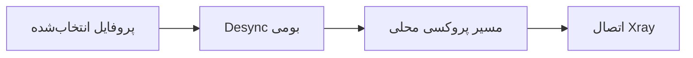

<div align="center">

# 🚀 پینگ‌اِن‌جی (PingNG)

### فورکی از v2rayNG با موتور بومی Desync، ابزارهای WARP و CDN Fronting برای Psiphon

رفتار اتصال هر پروفایل را کنترل کنید، تونل‌های WARP را پیکربندی کنید، تنظیمات TLS را تغییر دهید و اتصال را در یک کلاینت اندرویدی عیب‌یابی کنید.


[English](README.md) · **فارسی**

</div>

---

## 🌟 چرا PingNG؟

PingNG تجربهٔ آشنای v2rayNG را حفظ می‌کند و قابلیت‌هایی مانند Desync وابسته به پروفایل، چند نوع تونل WARP و CDN Fronting برای Psiphon را به آن می‌افزاید. تنظیمات هر قابلیت همراه پروفایل ذخیره می‌شود و هنگام اتصال همان پروفایل اعمال خواهد شد.

### نگاهی سریع

| قابلیت | v2rayNG | PingNG |
|---|:---:|:---:|
| موتور بومی Desync در اندروید | — | ✅ |
| تنظیم Desync جداگانه برای هر پروفایل | — | ✅ |
| WARP Plus با Outer و Inner | — | ✅ |
| WARP WireGuard | — | ✅ |
| WARP MASQUE/H2 | — | ✅ |
| تنظیم و جست‌وجوی FinalMask برای پروفایل‌های WARP | — | ✅ |
| Psiphon CDN Fronting برای پروفایل‌ها | — | ✅ |
| اجرای Psiphon روی WARP و WARP Plus | — | ✅ |
| ثبت کلید WARP از طریق پروکسی | — | ✅ |
| ویرایشگر هوشمند پارامترهای Desync | — | ✅ |
| Fake SNI تصادفی با چند دامنه | — | ✅ |
| اثرانگشت TLS از نوع `unsafe` (PattNG) | — | ✅ |
| مجموعه Cipher Suite قابل ویرایش (PattNG) | — | ✅ |
| نمودار مصرف ترافیک | — | ✅ |
| اتصال از طریق پروکسی HTTP | — | ✅ |

## 🛡️ موتور Desync

موتور Desync به‌صورت بومی در اندروید اجرا می‌شود و به دسترسی روت نیاز ندارد. برای پروفایل‌های سازگار، حالت و پارامترهای Desync را تنظیم کنید تا هنگام اتصال همان پروفایل اعمال شوند. در WARP MASQUE/H2 می‌توان Desync را از اتصال TLS بیرونی عبور داد.

### پروفایل‌های داخلی

| پروفایل | کاربرد |
|---|---|
| **Off** | اتصال بدون Desync |
| **Light** | پردازش سبک و سازگاری گسترده |
| **Balanced** | تعادل مناسب برای استفادهٔ روزمره |
| **Severe** | پردازش قوی‌تر برای شبکه‌های محدودتر |
| **Adaptive** | تنظیم رفتار متناسب با اتصال |
| **Custom** | کنترل دستی پارامترهای موجود |

### روش‌های سفارشی

- `Split`
- `Disorder`
- `Fake SNI`
- `Out of Band`
- `Disorder + Out of Band`

فقط گزینه‌های مربوط به روش انتخاب‌شده نمایش داده می‌شوند. بسته به روش، می‌توانید مقادیری مانند **Position**، **Fake TTL**، **Fake SNI**، **TLS Record Position** و **Timeout** را تنظیم کنید.

### مسیر اتصال



اگر Desync روشن باشد، موتور باید با موفقیت اجرا و به اتصال متصل شود؛ در غیر این صورت VPN شروع نمی‌شود. به این ترتیب اتصال بدون اعمال Desync انتخاب‌شده، بی‌صدا ادامه پیدا نمی‌کند.

## 🌐 WARP

PingNG سه گزینهٔ WARP ارائه می‌دهد:

- **WARP Plus** — پروفایل‌های Outer و Inner همراه با حالت‌های جست‌وجوی اندپوینت، مرحلهٔ Verify و تنظیمات FinalMask.
- **WARP WireGuard** — پروفایل تک‌مرحله‌ای WARP بر پایهٔ WireGuard با ساخت خودکار اکانت و کلید و اسکن اندپوینت.
- **WARP MASQUE/H2** — تونل مستقل MASQUE روی HTTP/2 با اسکن اندپوینت و تنظیم SNI.

### اسکن اندپوینت و FinalMask

اسکن WARP از حالت‌های مختلف و اندپوینت‌های Custom پشتیبانی می‌کند. مرحلهٔ Verify اندپوینت‌هایی را بررسی می‌کند که در مرحلهٔ اسکن پیدا شده‌اند و پیشرفت را بر اساس تعداد واقعی گزینه‌های در صف نشان می‌دهد. فیلدهای FinalMask و گزینهٔ **Find FinalMask Setting** برای پروفایل‌های WARP Plus و WARP WireGuard در دسترس هستند.

### پروکسی ثبت کلید WARP

پروفایل‌های WARP گزینهٔ **Proxy** را برای ثبت اکانت و کلید دارند. حالت **Auto** ابتدا اتصال مستقیم را امتحان می‌کند و در صورت شکست، به پروفایل VLESS داخلی **Proxy-1** می‌رود. همچنین می‌توان یکی از پروفایل‌های موجود در PingNG را انتخاب کرد. Proxy-1 داخلی فقط برای این فرایند استفاده می‌شود و به فهرست اصلی کانفیگ‌ها اضافه نمی‌شود.

## 🛡️ Psiphon و CDN Fronting

Psiphon را می‌توان برای هر پروفایل، از جمله WARP و WARP Plus، فعال کرد. یکی از حالت‌های **Auto**، **Direct** یا **CDN Fronting** را انتخاب کنید:

- IPهای CDN و نام سرور (SNI) دلخواه را وارد کنید.
- فهرست‌های داخلی CDN را برای اسکن انتخاب کنید یا از فهرست‌های پیش‌فرض استفاده کنید.
- در صورت نیاز، اتصال Psiphon را از پروکسی HTTP CONNECT تنظیم‌شده عبور دهید.

## 🎲 Fake SNI تصادفی با چند دامنه

چند دامنه را با کاما از هم جدا کنید و در بخش **Fake SNI** وارد کنید:

```text
hcaptcha.com, speedtest.net, example.com
```

PingNG به‌صورت خودکار:

- فاصله، خط جدید، نقطه‌ویرگول و نویسهٔ `|` را به جداکنندهٔ کاما تبدیل می‌کند.
- ورودی‌های تکراری را حذف می‌کند.
- برای هر اتصال جدید یک SNI را به‌صورت تصادفی انتخاب می‌کند.
- SNI انتخاب‌شده را تا پایان همان اتصال ثابت نگه می‌دارد.

## 🔐 تنظیمات پیشرفتهٔ TLS

- گزینهٔ اثرانگشت TLS از نوع `unsafe` را اضافه می‌کند (PattNG).
- فیلد **Cipher Suites** را برای ویرایش در اختیار می‌گذارد (PattNG).
- Cipher Suites را همراه پروفایل انتخاب‌شده ذخیره می‌کند.
- مقدار را در پیکربندی تولیدشدهٔ Xray اعمال می‌کند.
- مقدار را در مسیرهای پشتیبانی‌شدهٔ ورود، خروجی‌گرفتن و اشتراک‌گذاری حفظ می‌کند.

## 🧩 نوع‌های کانفیگ پشتیبانی‌شده

Desync وابسته به پروفایل برای کانفیگ‌های سازگار TCP/TLS، از جمله موارد زیر، در دسترس است:

`VMess` · `VLESS` · `Shadowsocks` · `SOCKS` · `HTTP` · `Trojan` · `WARP MASQUE/H2`

## ✅ نکات اعتبارسنجی

- تنظیمات Desync برای هر پروفایل ذخیره و در مسیر اتصال همان پروفایل اعمال می‌شود.
- نام‌های نمایشی به روش‌های بومی مربوطه نگاشت می‌شوند.
- انتخاب تصادفی Fake SNI از طریق گزارش‌های زمان اجرا بررسی شده است.
- نسخهٔ Xray-core روی **26.9.9** تنظیم شده است.

پیش از انتشار، آزمایش برنامه روی نسخه‌های مختلف اندروید، دستگاه‌های گوناگون و شرایط شبکهٔ متفاوت توصیه می‌شود.

## 🙏 سپاسگزاری

- بر پایهٔ [2dust/v2rayNG](https://github.com/2dust/v2rayNG) و PattNG.
- توسعه و رابط کاربری PingNG: **ReZa Kh**.
- بهبودهای TLS با الهام از مشارکت‌های جامعهٔ v2rayNG انجام شده‌اند.

## ⚠️ سلب مسئولیت

از این پروژه فقط مطابق قوانین کشور خود و شرایط سرویس‌هایی که به آن‌ها متصل می‌شوید استفاده کنید. مسئولیت تنظیمات و نحوهٔ استفاده بر عهدهٔ شماست.

---

<div align="center">

ساخته‌شده با ❤️ برای مردم ایران

</div>
